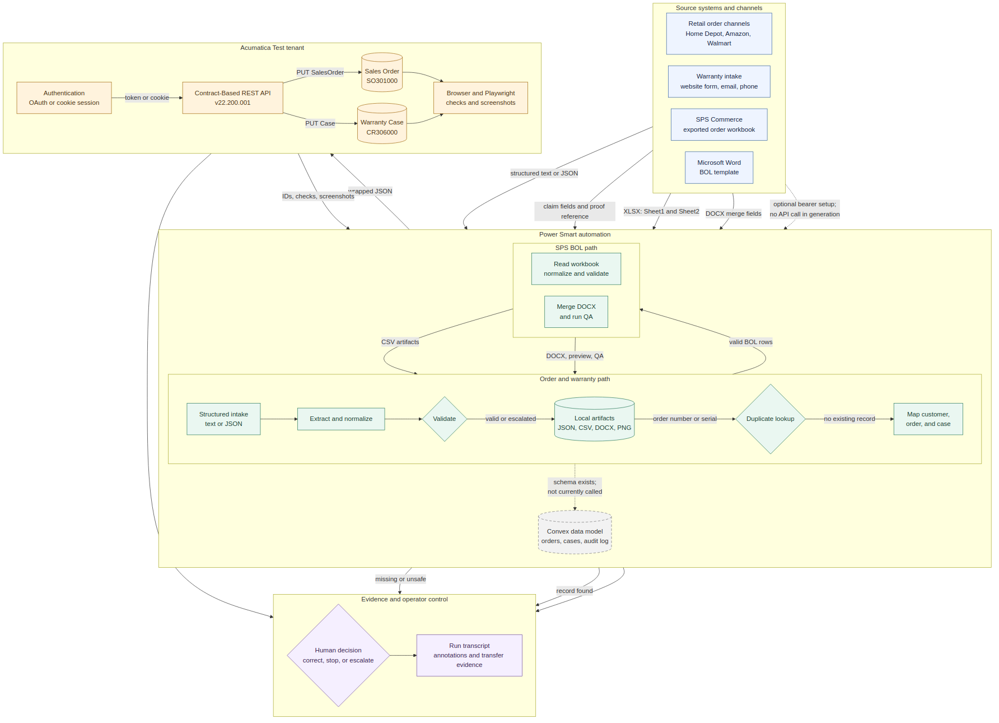

# Power Smart workflow and system interchange guide

This guide maps the three implemented Power Smart proof-of-concept workflows: retail order intake, warranty intake, and SPS bill-of-lading generation. It separates automated runtime connections from operator-controlled steps and components that are present in the repository but are not wired into the current execution path.



[Open the zoomable SVG version](power-smart-system-landscape.svg).

## How to read the diagram

- **Solid arrows** are active file, API, or browser handoffs used by the current workflows.
- **Decision diamonds** are stop, correct, or escalate points. They prevent a retry from creating a duplicate or unsafe record.
- **Dashed arrows** mark capabilities that are modeled or configurable but are not active data interchanges. Convex has a schema and mutations, but the pipeline does not call them; SPS bearer credentials can be configured, but BOL generation does not call the SPS API.
- **Local artifacts** are the audit boundary shared by the workflows. They hold the transformed payloads, validation reports, generated documents, verification results, and screenshots.

## End-to-end operating sequence

1. **Identify the source and open the evidence trail.** The operator names the intake source or input files and starts a run transcript. This matters because the same customer identifiers can arrive through a website form, email, phone notes, a retailer order, or an SPS export.
2. **Read and normalize the source.** The order and warranty path converts structured text or JSON into canonical fields. The SPS path converts workbook columns into normalized rows.
3. **Validate before crossing a system boundary.** Required fields and formats are checked before an Acumatica API write or a DOCX merge. Invalid order data stops; incomplete warranty proof is escalated; invalid BOL rows are excluded from document generation.
4. **Check for an existing Acumatica record.** A retailer order number is searched before creating a sales order, and a product serial is searched before creating a warranty case. These lookups are operator-controlled commands rather than an automatic stage inside `npm run pipeline`.
5. **Map the validated data to the destination contract.** Order data becomes an Acumatica `SalesOrder` entity, warranty data becomes an Acumatica `Case`, and a valid shipping row becomes a set of Word merge fields.
6. **Write the destination record or document.** The Acumatica CLI sends JSON over HTTPS; the BOL generator patches the DOCX package locally and writes one document per valid row.
7. **Verify the business identifier at the destination.** The order number, case serial, PO, and BOL number are checked in API responses, Acumatica screens, manifests, previews, and QA reports.
8. **Record the transfer and evidence.** Every milestone belongs in the transcript with the source, destination, artifact, returned identifier, and an annotation telling the reviewer what proves the step succeeded.

## Workflow 1: retail order intake

**Goal:** turn a retailer order received as structured customer data into one Acumatica sales order, without creating a duplicate, and prove that the retailer order number landed on screen `SO301000`.

| Step | Action | System or component | Interchange and output | Stop or success condition |
|---|---|---|---|---|
| 1 | Receive the order from a website form, email body, phone entry, or sample fixture. | Customer/retailer channel → Power Smart automation | `Key: Value` text or a JSON object containing customer, retailer, order, product, and serial fields. | The source is named and no missing value is invented. |
| 2 | Convert raw labels to canonical field names. | `parseStructuredOrder` or `parseJsonOrder` | Aliases such as `Your Name`, `Order #`, and `Model Number/SKU` become `customerName`, `orderNumber`, and `modelSku`. | All ten required fields are populated. |
| 3 | Normalize and validate. | `normalizeDate`, `recognizeRetailer`, `validateOrder` | The date becomes `YYYY-MM-DD`; the checks cover a recognized retailer, email format, serial length, and ISO date format. | A failed check stops the push and goes to a human for correction. |
| 4 | Write the local transfer object. | Pipeline → local artifact store | `artifacts/acumatica-payload.json` contains an `.order` object and a derived `.warranty` object. `artifacts/pipeline-results.json` records phase results. | The payload is valid JSON and contains the source retailer order number. |
| 5 | Search Acumatica for the retailer order number. | Acumatica CLI → Contract-Based REST API | `GET SalesOrder?$filter=CustomerOrder eq '<retailer order>'`. Run `npm run acumatica -- lookup-order --customer-order <number>`. | `found: 0` permits creation. Any match is shown to the operator and creation stops. |
| 6 | Resolve the Acumatica customer. | `resolveCustomerId` | Home Depot is split into Canada `C00006` or US `C00008` using the address; Amazon maps to `C00002`; Walmart maps to `C00009`. | An unrecognized retailer falls back to `C00001`, which requires human confirmation. |
| 7 | Map the order to the Acumatica entity contract. | Acumatica CLI | The CLI wraps `OrderType`, `CustomerID`, `CustomerOrder`, `Date`, `RequestedOn`, and `Description` as `{ "value": ... }`; customer, address, model, and serial are placed in the note. | The retailer order number remains in `CustomerOrder`; it is the cross-system correlation key. |
| 8 | Authenticate and create the sales order. | Acumatica authentication and REST API | OAuth is attempted first; a saved cookie session is the fallback. The write is `PUT /entity/Default/22.200.001/SalesOrder`. | HTTP success and a returned `OrderNbr`, such as `SO574030`, prove creation. |
| 9 | Verify the destination. | Acumatica API, browser, and Playwright | `npm run acumatica -- url sales-order <OrderNbr>` opens `SO301000`; the verifier also reads the entity through the API and saves screenshots and `ui-verification.json`. | The authoritative API result contains the expected `OrderNbr` and `CustomerOrder`; the screen is captured and annotated. |
| 10 | Close the evidence trail. | Run transcript | Record the input-to-JSON transfer, duplicate result, customer mapping, API response, order ID, deep link, and screenshot. | A reviewer can follow the order from source identifier to Acumatica identifier without rerunning the workflow. |

### Order field mapping

| Intake field | Local JSON field | Acumatica destination |
|---|---|---|
| Retailer order number | `orderNumber` | `SalesOrder.CustomerOrder` |
| Order date | `orderedDate` | `SalesOrder.Date` and `RequestedOn` |
| Retailer/platform | `platform` | Customer resolution, `Description`, and note |
| Product category | `productCategory` | `Description` |
| Customer, phone, address, model, serial | Corresponding order fields | Multiline sales-order note |
| Resolved retailer account | `customerId` or resolver output | `SalesOrder.CustomerID` |

## Workflow 2: warranty intake

**Goal:** turn a warranty registration or claim into one Acumatica case, preserve the product serial and validation disposition, and prove the case on screen `CR306000`.

| Step | Action | System or component | Interchange and output | Stop or success condition |
|---|---|---|---|---|
| 1 | Read the returned registration template, structured form, email, or phone notes. | Customer channel → Power Smart automation | Customer contact, address, product/model, serial, retailer, purchase date/order, and proof-of-purchase reference. | Every supplied field is captured; absent fields stay empty. |
| 2 | Apply the product-identification rule. | Operator policy | A warranty serial is expected to be 19 numeric digits. For a mower, use the deck or grass-bag-flap label rather than an engine label; for a snow blower, use the label below the chute. | An unreadable or malformed serial is returned for correction and is not pushed. |
| 3 | Search by serial before creating a case. | Acumatica CLI → Contract-Based REST API | `GET Case?$filter=substringof('<serial>',Subject)`. Run `npm run acumatica -- lookup-warranty <serial>`. | An existing case is shown and the run stops unless the operator explicitly needs a separate claim for the same unit. |
| 4 | Choose registration or claim handling. | Operator decision | If no registration exists, the operator can draft a product-specific email under `artifacts/outbound-emails/`. If enough claim data exists, processing continues. | Drafts require human review before sending; the automation does not send customer email. |
| 5 | Build the warranty payload. | Pipeline or prepared JSON | The sample pipeline derives `.warranty` from the extracted order fields and adds `validationResult` and `validationNotes`. A standalone payload can be passed to `push-warranty`. | `claimantName`, `serialNumber`, and a validation disposition are present. |
| 6 | Validate proof and set the route. | Operator policy plus payload mapping | Complete proof yields `validated`; missing proof yields `escalated` with the reason in `validationNotes`. | Escalation is allowed, but the reason must be explicit. |
| 7 | Map the claim to an Acumatica case. | Acumatica CLI | `CaseClass` is sent as `RQ`; the subject is `Warranty Claim — <name> — <serial>`; contact, product, retailer, order, purchase date, and validation notes go into `Description`. | `validated` maps to medium severity; `escalated` maps to high severity. |
| 8 | Authenticate and create the case. | Acumatica authentication and REST API | `PUT /entity/Default/22.200.001/Case` with wrapped JSON values. `push-both` creates the sales order first and the case second, while retaining separate results. | HTTP success and a returned `CaseID` prove creation. If one half of `push-both` fails, retry only that half. |
| 9 | Verify the destination. | Acumatica API, browser, and Playwright | `npm run acumatica -- url case <CaseID>` opens `CR306000`; the verifier reads the case and checks that the serial is in the subject. | The API returns the expected case ID and subject serial; the screen is captured and annotated. |
| 10 | Close the evidence trail. | Run transcript | Record the serial lookup, proof decision, payload transfer, case ID, severity, URL, and screenshot. | A reviewer can see why the claim was validated or escalated and where it landed. |

### Warranty control boundary

The operating policy requires a 19-digit numeric serial and proof-of-purchase handling. The current shared `validateOrder` function only checks that a serial has at least eight characters, and the pipeline does not independently inspect a proof image. Those stronger warranty rules are operator controls today; they should not be described as automatic enforcement.

## Workflow 3: SPS bill-of-lading generation

**Goal:** convert an SPS order export and a Word BOL template into one quality-checked BOL document per valid order row, entirely offline.

| Step | Action | System or component | Interchange and output | Stop or success condition |
|---|---|---|---|---|
| 1 | Confirm the workbook, Word template, and output directory. | SPS export, Microsoft Excel, Microsoft Word, local filesystem | Source `.xlsx` with `Sheet1` order rows and `Sheet2` destination references; template `.docx` with merge fields. | Both input files exist at the named paths. |
| 2 | Read the workbook. | `xlsx` library in `sps-bol` CLI | `Sheet1` becomes order rows; `Sheet2` becomes destination-reference rows. Empty rows are removed and cells become strings. | Missing sheets or unreadable files fail the run. |
| 3 | Preserve the source data. | BOL generator → local artifact store | `01_sps_export_raw.csv` and `02_destination_reference.csv`. | The raw row counts are visible before any normalization. |
| 4 | Normalize the order columns. | `normalizeOrders` | Seventeen display headers map to lowercase payload fields; numeric ZIP codes are padded to five characters. Output: `03_normalized_orders.csv`. | The normalized row count matches the non-empty source row count. |
| 5 | Publish the template contract. | BOL generator | `04_bol_field_mapping.csv` maps each Word placeholder, such as `«PO_»`, to a payload field and required/optional status. | Every template placeholder has an intentional source field. |
| 6 | Validate each normalized row. | `validationRows` | Ten required fields are checked: name, address line 1, city, state, ZIP, PO, quantity, weight, carrier, and BOL number. Output: `06_validation_report.csv`. | Invalid rows name the missing fields and are excluded from generation. |
| 7 | Build merge-ready payload rows. | `payloadRows` | Valid normalized rows become title-cased merge fields in `05_bol_payload.csv`. | The payload row count equals the valid-row count. |
| 8 | Merge the Word template. | `jszip` and DOCX XML transformer | Each payload row replaces Word merge fields inside `word/document.xml`; the output name combines BOL number and PO. | One `.docx` is written under `generated_bols/` for every valid row. |
| 9 | Run document QA. | BOL generator | The generator searches for unreplaced `«... »` placeholders and creates a text preview. Outputs: `07_output_manifest.csv`, `08_docx_qa_report.csv`, and `previews/*.txt`. | A document with remaining placeholders is marked `needs_review`. |
| 10 | Calculate shipping arithmetic. | `arithmeticRows` and store-rate fixture | `09_bol_arithmetic.csv` records store rate, cartons, pallets, weight ratios, and partial-pallet notes. Store rates come from `fixtures/sps-entity-qty-per-pallet.json`; unknown stores default to 12 cartons per pallet. | Arithmetic is reviewed against the source row and store rule. |
| 11 | Write and verify the run summary. | BOL generator and verification CLI | `automation_summary.json` reports input, valid, and generated counts. `npm run verify-automation` performs repository, extraction, CLI, and core-artifact smoke checks. | Valid rows, manifest rows, generated files, and QA status are reconciled before release. |
| 12 | Close the evidence trail. | Run transcript | Insert the validation table, arithmetic table, one text or rendered BOL preview, and annotations naming the ship-to, PO, BOL number, and any exception. | A reviewer can trace one workbook row through every CSV into its final DOCX. |

### SPS BOL artifact chain

```text
SPS-exported XLSX
  ├─ Sheet1 ──> 01_sps_export_raw.csv
  │               └─> 03_normalized_orders.csv
  │                    ├─> 06_validation_report.csv
  │                    ├─> 09_bol_arithmetic.csv
  │                    └─> 05_bol_payload.csv
  │                           + Word template DOCX
  │                           └─> generated_bols/*.docx
  │                                ├─> previews/*.txt
  │                                ├─> 07_output_manifest.csv
  │                                └─> 08_docx_qa_report.csv
  └─ Sheet2 ──> 02_destination_reference.csv

All counts ──> automation_summary.json
```

The SPS generator is offline. SPS Commerce is the business source of the exported workbook, but no live SPS API request occurs during `generate`; the CLI's bearer-token commands only configure or probe access.

## Connected-system glossary

| System or component | Definition | Role in this workflow | Connection and status |
|---|---|---|---|
| Power Smart customer channels | Website forms, registration emails, and phone notes through which customer and product data arrive. | Supply retail-order and warranty fields. | Human or application-to-text/JSON handoff; upstream source rather than a directly implemented API. |
| Retailer channels | Home Depot, Amazon, Walmart, and other sellers that issue retailer order numbers. | Supply the platform name and correlation order number; the name also selects an Acumatica customer account. | No retailer API is called by this repository. |
| Power Smart automation runtime | Node.js and TypeScript code invoked through npm scripts. | Parses, validates, maps, pushes, generates files, and prints structured results. | Active local runtime. |
| Local artifact store | The repository's `artifacts/` directory. | Holds intermediate payloads, audit results, CSVs, DOCX files, previews, QA reports, and screenshots. | Active filesystem interchange and the current durable run evidence. |
| Acumatica Test tenant | AmeriSun's non-production ERP environment. | Stores sales orders and warranty cases and exposes their entry screens. | Active external destination over HTTPS. |
| Acumatica authentication service | The login and identity endpoints that establish API authorization. | Returns either an OAuth bearer token or session cookies accepted by the entity API. | OAuth is attempted first; saved cookie authentication is the fallback. |
| Acumatica Contract-Based REST API | Acumatica's versioned entity interface under `/entity/Default/22.200.001/`. | Searches and writes `SalesOrder`, `Case`, and `Customer` entities. | Active JSON/HTTPS interchange. |
| Acumatica UI | ERP screens such as `SO301000`, `SO303000`, and `CR306000`. | Gives the operator visual proof of records created through the API. | Active browser destination; Acumatica's single-page rendering can make automated text extraction inconclusive, so API checks remain authoritative. |
| SPS Commerce | The EDI/order network from which shipping-order data is exported. | Business source for BOL rows. | Exported XLSX is active; a live SPS API connection is not used by generation. |
| Microsoft Excel workbook | An `.xlsx` package containing source order and destination-reference sheets. | Carries SPS shipping rows into the offline generator. | Active file interchange parsed by the `xlsx` library. |
| Microsoft Word template | A `.docx` package containing BOL layout and merge fields. | Supplies the visual document structure into which validated row values are inserted. | Active file interchange patched through the DOCX XML package. |
| Playwright | Browser automation library. | Opens Acumatica screens, performs API cross-checks, and saves screenshots and JSON results. | Active verification component when browser verification is run. |
| Convex | A hosted application database with realtime queries and mutations. | The repository defines tables for orders, warranty cases, retailers, and Acumatica logs. | Available design only: the current pipeline does not invoke Convex, so no runtime interchange should be claimed. |
| Run transcript | A chronological, annotated record in the operator's document pane. | Connects each technical transfer to human-readable evidence and decisions. | Required operating evidence; maintained by the agent/operator rather than the CLIs. |

## Interchange glossary

| Term | Definition in this workflow |
|---|---|
| Interchange | A boundary where data changes owner, system, transport, or representation, such as customer text becoming JSON or a JSON entity becoming an Acumatica record. |
| Structured text | One field per line in `Label: Value` form. The parser recognizes aliases and converts them to canonical JSON keys. |
| Webhook JSON | A machine-delivered JSON object from an upstream application. The extraction library can normalize string-valued keys, although the sample pipeline currently uses structured text. |
| Canonical field | The stable internal name used after source labels are normalized, such as `orderNumber` or `serialNumber`. |
| Payload | The destination-ready set of fields sent to an API or document merge. `acumatica-payload.json` contains separate `order` and `warranty` payloads. |
| Contract-Based REST API | Acumatica's versioned JSON entity API. Fields are represented as objects such as `{ "value": "SO" }` rather than bare values. |
| HTTPS | Encrypted HTTP transport used for Acumatica authentication, lookups, writes, and verification reads. |
| OAuth bearer token | A short-lived access credential sent in the `Authorization: Bearer ...` header. Secrets never belong in workflow artifacts or transcripts. |
| Cookie session | Acumatica session cookies created by `/entity/auth/login` and stored locally for later API and browser requests. |
| OData filter | A query expression in an Acumatica GET request, used here to find a sales order by `CustomerOrder` or a case whose subject contains a serial. |
| Correlation key | A business identifier carried across systems so the same record can be found later. The key is the retailer order number for orders and the product serial for warranty cases. |
| Idempotency check | A lookup performed before a write so a retry does not create a second business record. The current commands support this check, but `npm run pipeline` does not run it automatically. |
| XLSX | The zipped XML workbook format read from the SPS export. `Sheet1` carries order rows and `Sheet2` carries destination references. |
| CSV | A plain-text tabular interchange format used for raw, normalized, validation, payload, manifest, QA, and arithmetic artifacts. |
| DOCX | The zipped XML Word document format used for the BOL template and generated documents. |
| Merge field | A named placeholder in the Word template, such as `«BOL_Number»`, replaced with a value from one valid payload row. |
| Manifest | `07_output_manifest.csv`, which links each valid row and business identifier to its generated DOCX and preview path. |
| QA report | A machine-readable check of generated output. The BOL QA report lists unreplaced placeholders; Acumatica UI verification records API checks, UI checks, and screenshots. |
| Deep link | A URL that opens a specific Acumatica screen and record using a screen ID and query parameters. |
| Sandbox/Test tenant | A non-production Acumatica company used to prove behavior without writing to the production ERP. It still contains shared records, so duplicate checks remain mandatory. |
| Escalation | A deliberate route for data that is incomplete or needs human judgment. Warranty escalation becomes high severity; invalid order or BOL data is stopped for correction. |

## Interchange register

| ID | From → To | Transport / format | Business key | Validation or control | Result |
|---|---|---|---|---|---|
| I-01 | Customer or retailer channel → extraction library | Structured text or JSON | Retailer order number, serial | Required fields and alias mapping | Canonical order object |
| I-02 | Extraction library → local artifacts | JSON file | Retailer order number | Retailer, email, serial, and date checks | `acumatica-payload.json` and phase results |
| I-03 | Acumatica CLI → authentication service | HTTPS form or JSON login | Tenant and user session | Local protected config; no secret logging | Bearer token or cookie session |
| I-04 | Acumatica CLI → Acumatica entity API | HTTPS GET with OData filter | Retailer order number or serial | Duplicate lookup before write | Zero matches or existing record list |
| I-05 | Order payload → Acumatica `SalesOrder` | HTTPS PUT, wrapped JSON | `CustomerOrder` | Customer resolution and human approval for fallback | `OrderNbr` and entity response |
| I-06 | Warranty payload → Acumatica `Case` | HTTPS PUT, wrapped JSON | Serial in `Subject` | Proof/serial policy and validation disposition | `CaseID` and entity response |
| I-07 | Acumatica API and UI → local evidence | HTTPS GET, browser navigation, PNG, JSON | `OrderNbr`, `CaseID`, order number, serial | API checks authoritative; screenshot annotated | Verification JSON and screenshots |
| I-08 | SPS Commerce → local workbook | Manual/exported XLSX | PO and BOL number | Correct workbook and sheets selected | Source workbook |
| I-09 | XLSX workbook → normalized artifacts | In-process XLSX read, CSV write | Row ID, PO, BOL number | Header mapping, ZIP normalization, required fields | Raw, normalized, validation, payload, arithmetic CSVs |
| I-10 | Valid payload + Word template → BOL outputs | DOCX XML merge | PO and BOL number | Invalid rows excluded; placeholder scan | DOCX, preview, manifest, QA report |
| I-11 | Workflow artifacts → run transcript | Tables, images, paths, annotations | All returned business IDs | Every transfer names its source, destination, and proof | Human-readable audit trail |
| I-12 | Extraction model → Convex | No active transport | Intended order/case IDs | Schema and mutations exist only | No current runtime result |

## Responsibility and exception points

| Decision | Automated behavior | Human responsibility |
|---|---|---|
| Unknown retailer | The CLI resolves unsupported retailers to default customer `C00001`. | Confirm the fallback customer before allowing a push. |
| Existing order or warranty case | Lookup commands return matching records. | Stop, show the existing record, or explicitly approve a distinct claim. |
| Missing order data | Extraction or validation returns errors. | Correct the source; do not push. |
| Missing warranty proof | The payload can carry `escalated`, which maps to high severity. | Confirm the missing evidence and record the reason. |
| Invalid BOL row | The row is marked invalid and excluded from the merge payload. | Correct the workbook and regenerate. |
| Unreplaced Word placeholder | The generated document is marked `needs_review`. | Correct the field map or template before release. |
| UI text check fails while API passes | The verifier records the UI check as inconclusive because the ERP is a single-page application. | Review the screenshot; use the API result as the authoritative record check. |

## Completion evidence by workflow

- **Order intake:** validation pass, zero duplicate matches, successful `SalesOrder` response with `OrderNbr`, API confirmation of `CustomerOrder`, and an annotated `SO301000` screenshot.
- **Warranty intake:** serial lookup result, proof/validation disposition, successful `Case` response with `CaseID`, API confirmation of the serial in the subject, and an annotated `CR306000` screenshot.
- **SPS BOL:** validation and arithmetic tables, valid-row and generated-document counts reconciled, zero unintended placeholders, manifest paths present, and at least one annotated BOL preview.
